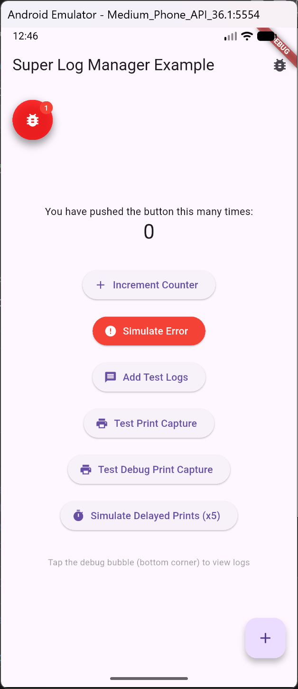

# Flutter Super Log Manager

<div align="center">

[](https://pub.dev/packages/flutter_super_log_manager)
[](https://opensource.org/licenses/MIT)
[](https://flutter.dev/)
[](https://dart.dev/)
[](https://flutter.dev/)
[](https://github.com/your-repo/flutter_super_log_manager)

**The Ultimate Flutter Debug Logging Solution**

_🚀 Automatic error catching • 🎯 Draggable debug bubble • 📱 Advanced log viewer • ⚡ Performance optimized_

  

</div>

## 📋 Table of Contents

- [✨ Features](#-features)
- [🚀 Quick Start](#-quick-start)
- [📖 Usage Examples](#-usage-examples)
- [🎯 API Reference](#-api-reference)
- [🎨 Customization](#-customization)
- [🔧 Integration Examples](#-integration-examples)
- [🚦 Production Usage](#-production-usage)
- [🐛 Troubleshooting](#-troubleshooting)
- [📝 Changelog](#-changelog)
- [📄 License](#-license)

## 🚀 Quick Start

1.  **Add dependency**

    ```yaml
    dependencies:
      flutter_super_log_manager: ^1.0.0
    ```

2.  **Initialize in main.dart**

    ```dart
    import 'package:flutter_super_log_manager/flutter_super_log_manager.dart';

    void main() {
      // Wrap your app with SuperLogManager.runApp
      SuperLogManager.runApp(
        const MyApp(),
        config: const SuperLogConfig(
          enabled: true,
          showOverlayBubble: true,
        ),
      );
    }
    ```

## 📖 Usage Examples

### Minimal Usage

Easily toggle the logger for production builds using a constant or environment variable:

```dart
import 'package:flutter/foundation.dart';
import 'package:flutter_super_log_manager/flutter_super_log_manager.dart';

// Toggle this flag to enable/disable the logger
const bool kEnableLogManager = kDebugMode; 

void main() {
  SuperLogManager.runApp(
    const MyApp(),
    config: const SuperLogConfig(
      enabled: kEnableLogManager,
    ),
  );
}
```

### Ready-made Configurations
 
We provide several named constructors for common use cases:

```dart
// 🏗️ Development: All features enabled (default)
config: const SuperLogConfig.development()

// 🚀 Production: Completely disabled, zero overhead
config: const SuperLogConfig.production()

// 🐛 Error Tracking: Only captures errors, no overlay
config: const SuperLogConfig.errorTracking()
```

### Comprehensive Configuration

Here is an example showing all available configuration options:

```dart
import 'package:flutter/material.dart';
import 'package:flutter_super_log_manager/flutter_super_log_manager.dart';

void main() {
  SuperLogManager.runApp(
    const MyApp(),
    config: const SuperLogConfig(
      // 🛠️ Core Settings
      enabled: true,              // Master switch for the logger
      maxLogs: 2000,              // Maximum logs to keep in memory
      
      // 🫧 Bubble Appearance
      showOverlayBubble: true,    // Show the floating debug bubble
      bubbleSize: 56.0,           // Size of the bubble
      bubbleColor: Colors.blue,   // Background color of the bubble
      bubbleIconColor: Colors.white, // Color of the bug icon
      initialBubblePosition: Offset(16, 100), // Start position
      enableBubbleDrag: true,     // Allow user to drag the bubble
      hideBubbleWhenScreenOpen: true, // Hide bubble when log screen is open
      enableLongBubbleClickExport: true, // Long press bubble to export logs
      
      // 🚨 Error Badge
      errorBadgeColor: Colors.red,     // Color of the error count badge
      errorBadgeTextColor: Colors.white, // Color of the badge text
      
      // ⚙️ Behavior
      autoDetectErrorLevel: true, // Auto-mark logs with "error" as Error level
      captureDebugPrint: true,    // Capture debugPrint() calls
      capturePrint: true,         // Capture print() calls
      mirrorLogsToConsole: true,  // Also print logs to system console
      mirrorLogsToConsole: true,  // Also print logs to system console
      
      // 📱 Log Screen UI
      panelHeightFraction: 0.9,   // Height of log screen (0.0 - 1.0)
      dimOverlayBackground: true, // Dim background when screen is open
      
      // ⚡ Features
      enableLogFiltering: true,   // Allow filtering by level
      enableLogSearch: true,      // Allow text search
      enableLogDeletion: true,    // Allow deleting logs
      enableLogExport: true,      // Allow copying logs to clipboard
    ),
  );
}
```

## ✨ Features

- **🚀 Automatic Error Catching**: Automatically captures Flutter framework errors and Dart exceptions.
- **🎯 Draggable Overlay**: Always-on-top debug bubble to access logs from anywhere.
- **📱 In-App Console**: Full-featured log viewer with search, filtering, and selection.
- **⚡ Performance Optimized**: Efficient log filtering and rendering, suitable for production use (when disabled).
- **🔍 Smart Filtering**: Filter logs by level (Info, Warning, Error) or search text instantly.
- **📋 Clipboard Support**: Copy logs to clipboard for easy sharing.
- **🎨 Fully Customizable**: Customize colors, sizes, and behavior via `SuperLogConfig`.
- **🔌 Print Capture**: Automatically captures `print()` and `debugPrint()` calls.


## 📱 Example App

Try the plugin with our comprehensive example app:

```bash
# Clone the repository
git clone https://github.com/your-repo/flutter_super_log_manager.git
cd flutter_super_log_manager

# Run the example
cd example
flutter run
```

The example demonstrates:

- ✅ Basic setup with debug bubble
- ✅ Advanced configuration
- ✅ Error simulation and logging
- ✅ Manual log addition
- ✅ Print capture functionality

<div align="center">

[](example/)

</div>

## 📊 Benchmarks

Performance benchmarks on various devices:

| Operation        |  Time  | Memory Impact |
| :--------------- | :----: | :------------ |
| Add 1000 logs    | < 50ms | ~2MB          |
| Search 5000 logs | < 10ms | Minimal       |
| Filter by level  | < 5ms  | Minimal       |
| Clear all logs   | < 20ms | Full recovery |

_Benchmarks performed on mid-range Android device_

## 📝 Changelog

### [1.0.0] - Initial Release

- 🚀 Complete debug logging system with automatic error catching
- 🎯 Draggable overlay bubble with RTL/LTR support
- 📱 Advanced log viewer with search, filtering, and selection
- 🎨 Extensive customization options and theming
- ⚡ Performance optimizations with batch processing
- 🌍 Internationalization support (RTL/LTR)
- 📦 Pure Dart implementation - works on all platforms
- 🔧 Easy production disable with zero overhead
- 📚 Comprehensive documentation and examples

## 🏆 Contributing

We welcome contributions! Here's how you can help:

### Ways to Contribute

- 🐛 **Report Bugs**: Open issues for bugs you find
- 💡 **Suggest Features**: Share your ideas for improvements
- 📝 **Improve Documentation**: Help make docs clearer
- 🧪 **Write Tests**: Add test cases for better reliability
- 💻 **Submit Code**: Fix bugs or add features

### Development Setup

```bash
# Fork and clone the repository
git clone https://github.com/your-username/flutter_super_log_manager.git
cd flutter_super_log_manager

# Install dependencies
flutter pub get

# Run tests
flutter test

# Run example app
cd example && flutter run
```

### Pull Request Process

1. Fork the project
2. Create your feature branch (`git checkout -b feature/AmazingFeature`)
3. Commit your changes (`git commit -m 'Add some AmazingFeature'`)
4. Push to the branch (`git push origin feature/AmazingFeature`)
5. Open a Pull Request

## 📞 Support & Community

### Getting Help

- 📖 **Documentation**: Check this README and inline code documentation
- 🐛 **Bug Reports**: [Open an issue](https://github.com/your-repo/flutter_super_log_manager/issues)
- 💬 **Discussions**: Use GitHub Discussions for questions
- 📧 **Email**: Contact maintainers for sensitive issues

### Resources

- 🎯 **[Example App](example/)**: Complete working example
- 📚 **[API Reference](#-api-reference)**: Detailed API documentation
- 🔧 **[Troubleshooting](#-troubleshooting)**: Common issues and solutions

## 📄 License

```text
MIT License

Copyright (c) 2025 Flutter Super Log Manager

Permission is hereby granted, free of charge, to any person obtaining a copy
of this software and associated documentation files (the "Software"), to deal
in the Software without restriction, including without limitation the rights
to use, copy, modify, merge, publish, distribute, sublicense, and/or sell
copies of the Software, and to permit persons to whom the Software is
furnished to do so, subject to the following conditions:

The above copyright notice and this permission notice shall be included in all
copies or substantial portions of the Software.

THE SOFTWARE IS PROVIDED "AS IS", WITHOUT WARRANTY OF ANY KIND, EXPRESS OR
IMPLIED, INCLUDING BUT NOT LIMITED TO THE WARRANTIES OF MERCHANTABILITY,
FITNESS FOR A PARTICULAR PURPOSE AND NONINFRINGEMENT. IN NO EVENT SHALL THE
AUTHORS OR COPYRIGHT HOLDERS BE LIABLE FOR ANY CLAIM, DAMAGES OR OTHER
LIABILITY, WHETHER IN AN ACTION OF CONTRACT, TORT OR OTHERWISE, ARISING FROM,
OUT OF OR IN CONNECTION WITH THE SOFTWARE OR THE USE OR OTHER DEALINGS IN THE
SOFTWARE.
```

---

<div align="center">

**Built with ❤️ for the Flutter community**

[⭐ Star us on GitHub](https://github.com/your-repo/flutter_super_log_manager) •
[🐛 Report Issues](https://github.com/your-repo/flutter_super_log_manager/issues) •
[📖 Documentation](https://github.com/your-repo/flutter_super_log_manager#readme)

</div>
